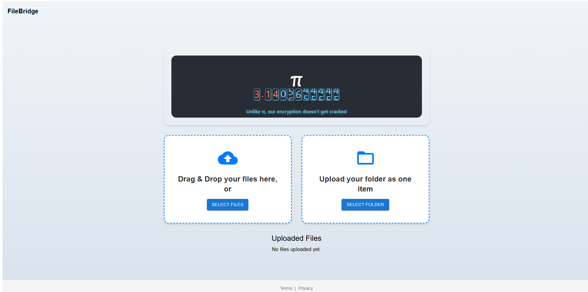

# FileBridge

FileBridge is a secure file transfer platform that enables end-to-end encrypted file sharing. Built with modern web technologies, it ensures your files remain private and secure throughout the entire transfer process.

## Technology Stack

- **Frontend**: React.js with Material-UI components
- **Backend**: Flask (Python) REST API
- **Database**: PostgreSQL for secure file metadata storage
- **Security**: Web Crypto API for client-side encryption

## Features

- 🔒 End-to-end encryption using AES-GCM
- 📤 Secure file upload with password protection
- 📥 Password-protected file downloads
- 📁 Support for both single files and folders
- 🗑️ Secure file deletion
- 🔑 API token authentication for additional security

## Screenshots

## Security Implementation

### End-to-End Encryption

FileBridge implements robust end-to-end encryption using the following security measures:

1. **Client-Side Encryption**:
   - Files are encrypted on the client side before upload using AES-GCM (Advanced Encryption Standard in Galois/Counter Mode)
   - A unique 256-bit encryption key is derived from your password using PBKDF2 (Password-Based Key Derivation Function 2)
   - Each file uses a unique 12-byte Initialization Vector (IV) for enhanced security
   - The encryption process uses 100,000 iterations of SHA-256 hashing for key derivation

2. **Server-Side Security**:
   - Files are stored in their encrypted form on the server
   - The server never has access to the decryption keys
   - Additional server-side encryption using Fernet (symmetric encryption) for stored files
   - API token authentication required for all operations

3. **Secure File Transfer**:
   - Files are transmitted over HTTPS
   - The original file is never stored in its unencrypted form
   - Decryption only happens on the client side after download

## Technical Details

### Encryption Process

1. **Upload Process**:
   - User selects a file and provides an encryption password
   - System generates a random salt
   - Password is used with PBKDF2 to derive a 256-bit AES key
   - File is encrypted using AES-GCM with a random IV
   - Encrypted file, salt, and IV are sent to the server

2. **Download Process**:
   - User requests file download and provides the decryption password
   - System retrieves the encrypted file, salt, and IV from the server
   - Password is used with the stored salt to derive the same AES key
   - File is decrypted client-side using AES-GCM
   - Decrypted file is available for download

## Security Best Practices

- Always use strong passwords for file encryption
- Keep your API tokens secure
- Never share your encryption passwords
- Delete files after they're no longer needed
- Use HTTPS for all connections

## License

MIT License

Copyright (c) 2025 FileBridge
Copyright (c) 2025 Amit (https://codepen.io/ghaste/pen/MYWQdKz) - Pi Animation Component

Permission is hereby granted, free of charge, to any person obtaining a copy
of this software and associated documentation files (the "Software"), to deal
in the Software without restriction, including without limitation the rights
to use, copy, modify, merge, publish, distribute, sublicense, and/or sell
copies of the Software, and to permit persons to whom the Software is
furnished to do so, subject to the following conditions:

The above copyright notice and this permission notice shall be included in all
copies or substantial portions of the Software.

THE SOFTWARE IS PROVIDED "AS IS", WITHOUT WARRANTY OF ANY KIND, EXPRESS OR
IMPLIED, INCLUDING BUT NOT LIMITED TO THE WARRANTIES OF MERCHANTABILITY,
FITNESS FOR A PARTICULAR PURPOSE AND NONINFRINGEMENT. IN NO EVENT SHALL THE
AUTHORS OR COPYRIGHT HOLDERS BE LIABLE FOR ANY CLAIM, DAMAGES OR OTHER
LIABILITY, WHETHER IN AN ACTION OF CONTRACT, TORT OR OTHERWISE, ARISING FROM,
OUT OF OR IN CONNECTION WITH THE SOFTWARE OR THE USE OR OTHER DEALINGS IN THE
SOFTWARE.

## Attribution

The Pi animation component used in this project is based on the work by Amit (https://codepen.io/ghaste/pen/MYWQdKz) and is used with permission under the MIT License.
